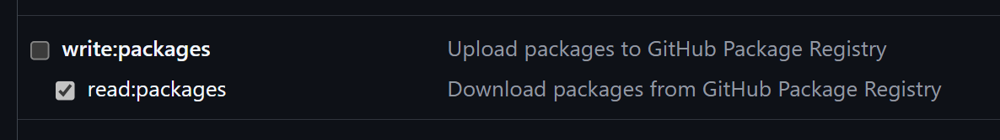
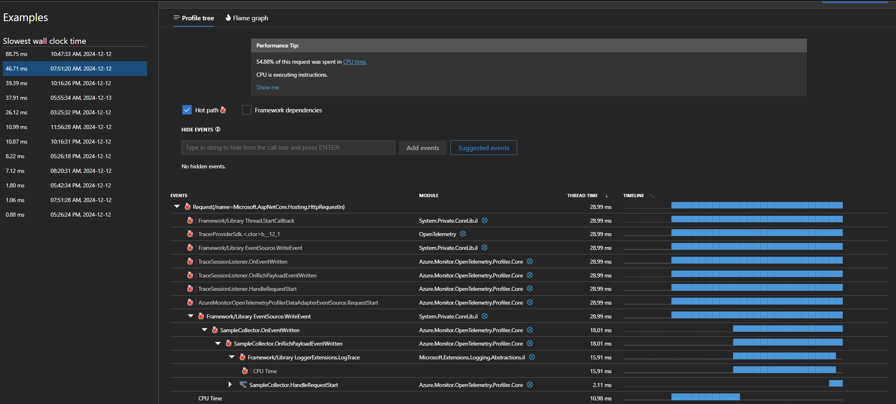

# Azure Monitor OpenTelemetry Profiler for .NET (PREVIEW)

## Description

Welcome to the home page of `Azure Monitor OpenTelemetry Profiler for .NET (PREVIEW)`.

## Get Started

### Step 0: Prerequisites

- **.NET 6.0 or later**: Install the latest .NET SDK from [here](https://dotnet.microsoft.com/download/dotnet).
- **Supported Environments**:

  - Windows
  - Linux
  - Containerized apps in Windows or Linux
  - Azure App Service
- **Application Insights Resource**: Follow [this guide](https://learn.microsoft.com/azure/azure-monitor/app/create-workspace-resource#create-a-workspace-based-resource) to create a new Application Insights resource.

### Step 1: Create a .NET Application

If you don't have an app already, you can create a new web API project using the following command:

```sh
dotnet new web
```

### Step 2: Restore NuGet Packages

Follow the steps below to restore NuGet packages using GitHub Packages as the source registry. If you prefer not to use GitHub Packages or a Personal Access Token (PAT), here are the alternatives:

1. [Restore NuGet Packages from Private Feed](./docs/UseBagetter.md) -- use a temporary private NuGet feed to restore the packages needed
1. [Use Profiler Assemblies Directly](./docs/UseAssembly.md) -- update the project to reference the assembly files instead of NuGet packages

#### a. Generate a Personal Access Token (PAT)

 Generate a Personal Access Token (PAT) that will be used to download the NuGet package by following [these instructions](https://docs.github.com/authentication/keeping-your-account-and-data-secure/managing-your-personal-access-tokens#creating-a-personal-access-token-classic).

Ensure that the Personal Access Token (PAT) has the `read:packages` permission.



#### b. Add NuGet Source

Create a `nuget.config` in your project root with the following content, replacing `your-user-name` with your GitHub username and `GITHUB-PAT` with the PAT from the previous step:

```xml
<configuration>
      <packageSources>
            <!--To inherit the global NuGet package sources remove the <clear/> line below -->
            <clear />
            <add key="nuget" value="https://api.nuget.org/v3/index.json" />
            <add key="github-azure" value="https://nuget.pkg.github.com/Azure/index.json" />  
      </packageSources>
      <packageSourceCredentials>
            <github-azure>
                  <add key="Username" value="your-user-name" />
                  <add key="ClearTextPassword" value="GITHUB-PAT" />
            </github-azure>
      </packageSourceCredentials>
</configuration>
```

For additional details on using the GitHub Packages registry, please refer to the [documentation](https://docs.github.com/packages/working-with-a-github-packages-registry/working-with-the-nuget-registry#installing-a-package).

#### c. Add NuGet Package Reference

Add a reference to the latest NuGet packages:

```sh
dotnet add package Azure.Monitor.OpenTelemetry.AspNetCore --prerelease
dotnet add package Azure.Monitor.OpenTelemetry.Profiler --prerelease
```

This will automatically add a dependency to [Azure.Monitor.OpenTelemetry.Exporter](https://www.nuget.org/packages/Azure.Monitor.OpenTelemetry.Exporter).

### Step 3: Enable Application Insights with OpenTelemetry

Follow the [instructions](https://learn.microsoft.com/azure/azure-monitor/app/opentelemetry-enable?tabs=aspnetcore#enable-opentelemetry-with-application-insights) to enable Azure Monitor OpenTelemetry for .NET.

Verify that the connection to Application Insights works -- [Confirm Data is Flowing](https://learn.microsoft.com/azure/azure-monitor/app/opentelemetry-enable?tabs=aspnetcore#confirm-data-is-flowing).

### Step 4: Enable Profiler

Append the call to `AddAzureMonitorProfiler()` in your code:

```csharp
using Azure.Monitor.OpenTelemetry.AspNetCore;
using Azure.Monitor.OpenTelemetry.Profiler;

...
builder.Services.AddOpenTelemetry()
        .UseAzureMonitor()
        .AddAzureMonitorProfiler();  // Append this line
...
```

### Step 5: Run Your Application

Run your application and check the log output. A successful execution will look like this:

```sh
PS > dotnet run

Building...

info: Microsoft.Hosting.Lifetime[14]
      Now listening on: http://localhost:5143
info: Microsoft.Hosting.Lifetime[0]
      Application started. Press Ctrl+C to shut down.
info: Microsoft.Hosting.Lifetime[0]
      Hosting environment: Development
info: Microsoft.Hosting.Lifetime[0]
      Content root path: C:\
info: Azure.Monitor.OpenTelemetry.Profiler.ServiceProfilerAgentBootstrap[0]
      Starting application insights profiler with connection string: InstrumentationKey=5d…
info: Azure.Monitor.OpenTelemetry.Profiler.Core.DumbTraceControl[0]
      Start writing trace file C:\Users\aaa\AppData\Local\Temp\SPTraces\...
...
```

### Step 6: View Profiler Data

You can view the profiler data by following [these instructions](https://learn.microsoft.com/azure/azure-monitor/profiler/profiler-data).



## Contributing

This project welcomes contributions and suggestions.  Most contributions require you to agree to a Contributor License Agreement (CLA) declaring that you have the right to, and actually do, grant us
the rights to use your contribution. For details, visit https://cla.opensource.microsoft.com.

When you submit a pull request, a CLA bot will automatically determine whether you need to provide a CLA and decorate the PR appropriately (e.g., status check, comment). Simply follow the instructions
provided by the bot. You will only need to do this once across all repos using our CLA.

This project has adopted the [Microsoft Open Source Code of Conduct](https://opensource.microsoft.com/codeofconduct/). For more information see the [Code of Conduct FAQ](https://opensource.microsoft.com/codeofconduct/faq/) or contact [opencode@microsoft.com](mailto:opencode@microsoft.com) with any additional questions or comments.

## Data Collection

The software may collect information about you and your use of the software and send it to Microsoft. Microsoft may use this information to provide services and improve our products and services. You may turn off the telemetry as described in the repository. There are also some features in the software that may enable you and Microsoft to collect data from users of your applications. If you use these features, you must comply with applicable law, including providing appropriate notices to users of your applications together with a copy of Microsoft’s privacy statement. Our privacy statement is located at <https://go.microsoft.com/fwlink/?LinkID=824704>. You can learn more about data collection and use in the help documentation and our privacy statement. Your use of the software operates as your consent to these practices.

## Trademarks

This project may contain trademarks or logos for projects, products, or services. Authorized use of Microsoft trademarks or logos is subject to and must follow [Microsoft's Trademark & Brand Guidelines](https://www.microsoft.com/en-us/legal/intellectualproperty/trademarks/usage/general).
Use of Microsoft trademarks or logos in modified versions of this project must not cause confusion or imply Microsoft sponsorship.
Any use of third-party trademarks or logos are subject to those third-party's policies.
