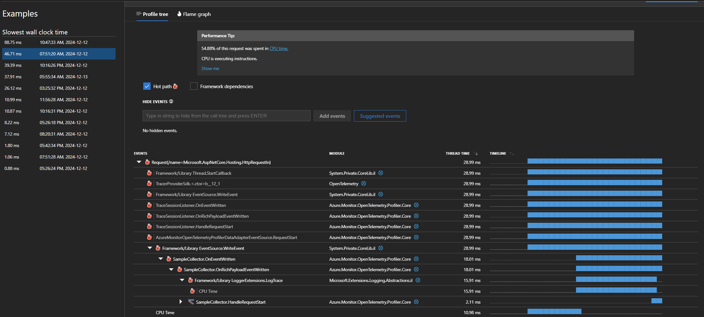

# Azure Monitor OpenTelemetry Profiler for .NET

| Continuous Integration | Status |
| ----------- | ----------- |
| Package | [](https://www.nuget.org/packages/Azure.Monitor.OpenTelemetry.Profiler/) |
| PR Build | [](https://dev.azure.com/devdiv/OnlineServices/_build/latest?definitionId=25440&repoName=ServiceProfiler-EP-Profiler&branchName=refs%2Fpull%2F615631%2Fmerge) |
| Official Build | [](https://dev.azure.com/devdiv/OnlineServices/_build/latest?definitionId=25454&repoName=ServiceProfiler-EP-Profiler&branchName=main) |

## Description

The Azure Monitor OpenTelemetry Profiler captures detailed performance traces of your live .NET applications with minimal overhead. It helps you identify slow code paths, high-CPU methods, and performance bottlenecks — then surfaces actionable insights through [Code Optimizations](https://learn.microsoft.com/azure/azure-monitor/insights/code-optimizations-profiler-overview#code-optimizations) in your Application Insights resource.

The profiler supports both **random sampling** (periodic snapshots) and **trigger-based profiling** (activated when CPU or memory usage exceeds a threshold). See [CPU Usage Monitoring](./docs/CpuUsageMonitoring.md) and [Memory Usage Monitoring](./docs/MemoryUsageMonitoring.md) for details on triggered profiling.

> ⭐ Not sure which `Profiler Agent` is right for you? Check out our [Profiler Agent Selection Guide](./docs/ProfilerAgentSelectionGuide.md) to help you choose the best option for your needs.

## Get Started

### Prerequisites

- **.NET 8.0 or later**: Install the latest .NET SDK from [here](https://dotnet.microsoft.com/download/dotnet).
- **Application Insights Resource**: Follow [this guide](https://learn.microsoft.com/azure/azure-monitor/app/create-workspace-resource#create-a-workspace-based-resource) to create a new Application Insights resource.
- **Azure Monitor OpenTelemetry**: This profiler works with the [Azure Monitor OpenTelemetry distro](https://learn.microsoft.com/azure/azure-monitor/app/opentelemetry-enable?tabs=aspnetcore).

> **Note:** If you are using the classic `Microsoft.ApplicationInsights.AspNetCore` SDK instead of OpenTelemetry, see [Microsoft Application Insights Profiler for ASP.NET Core](https://github.com/microsoft/ApplicationInsights-Profiler-AspNetCore) instead.

### Walkthrough

Assuming you are building an **ASP.NET Core application**:

1. **Create a .NET Application** (skip if you have one already)

    ```sh
    dotnet new web
    ```

2. **Add NuGet Packages**

    ```sh
    dotnet add package Azure.Monitor.OpenTelemetry.AspNetCore --prerelease
    dotnet add package Azure.Monitor.OpenTelemetry.Profiler --prerelease
    ```

    _Tip: use [floating versions](https://learn.microsoft.com/nuget/concepts/dependency-resolution#floating-versions) to stay on the latest package:_

    ```xml
    <ItemGroup>
        <PackageReference Include="Azure.Monitor.OpenTelemetry.AspNetCore" Version="[1.*-*, 2.0.0)" />
        <PackageReference Include="Azure.Monitor.OpenTelemetry.Profiler" Version="[1.*-*, 2.0.0)" />
    </ItemGroup>
    ```

3. **Enable Application Insights with OpenTelemetry**

    Follow the [instructions](https://learn.microsoft.com/azure/azure-monitor/app/opentelemetry-enable?tabs=aspnetcore#enable-opentelemetry-with-application-insights) to enable Azure Monitor OpenTelemetry for .NET, then verify that [data is flowing](https://learn.microsoft.com/azure/azure-monitor/app/opentelemetry-enable?tabs=aspnetcore#confirm-data-is-flowing).

4. **Enable Profiler**

    Append the call to `AddAzureMonitorProfiler()` in your code:

    ```csharp
    using Azure.Monitor.OpenTelemetry.AspNetCore;
    // Import the Azure.Monitor.OpenTelemetry.Profiler namespace.
    using Azure.Monitor.OpenTelemetry.Profiler;

    ...
    builder.Services.AddOpenTelemetry()
            .UseAzureMonitor()
            .AddAzureMonitorProfiler();  // Add Azure Monitor Profiler
    ...
    ```

- Run Your Application

    Run your application and verify the profiler starts. Look for this in the log output:

    ```sh
    PS > dotnet run

    Building...

    info: Microsoft.Hosting.Lifetime[14]
        Now listening on: http://localhost:5143
    info: Microsoft.Hosting.Lifetime[0]
        Application started. Press Ctrl+C to shut down.
    info: Microsoft.Hosting.Lifetime[0]
        Hosting environment: Development
    info: Microsoft.Hosting.Lifetime[0]
        Content root path: C:\
    info: Azure.Monitor.OpenTelemetry.Profiler.ServiceProfilerAgentBootstrap[0]
        Starting application insights profiler with connection string: InstrumentationKey=5d…
    info: Azure.Monitor.OpenTelemetry.Profiler.Core.DumbTraceControl[0]
        Start writing trace file C:\Users\aaa\AppData\Local\Temp\SPTraces\...
    ...
    ```

- View Profiler Data

    After a few minutes, profiler traces will appear in Application Insights. Follow [these instructions](https://learn.microsoft.com/azure/azure-monitor/profiler/profiler-data) to view them.

    

### Let Copilot enable the Profiler for you

As an alternative to the manual walkthrough above, you can use Copilot to enable the profiler automatically:

- [Enable Profiler using Copilot](./docs/AddAzureMonitorProfilerWithCoPilot.md)

## Next

- [Setup the Role name](./docs/SetupCloudRoleName.md)
- [Configuration Guide](./docs/Configurations.md)
- [CPU Usage Monitoring](./docs/CpuUsageMonitoring.md)
- [Memory Usage Monitoring](./docs/MemoryUsageMonitoring.md)
- [Read the examples](#examples)

## Troubleshooting

If profiles are not appearing in Application Insights:

1. **Check logs** — Enable debug logging to see the profiler pipeline activity:
    ```json
    {
      "Logging": {
        "LogLevel": {
          "Microsoft.ServiceProfiler": "Debug",
          "Microsoft.ApplicationInsights.Profiler": "Debug"
        }
      }
    }
    ```
2. **Verify connection string** — Ensure your Application Insights connection string is configured correctly.
3. **Check triggers** — If using CPU or memory triggers, verify your thresholds are below observed usage levels. See [CPU Usage Monitoring](./docs/CpuUsageMonitoring.md) and [Memory Usage Monitoring](./docs/MemoryUsageMonitoring.md).
4. **Entra authentication** — If your Application Insights resource requires Entra (AAD) authentication, configure credentials accordingly. The profiler will log an error if authentication is missing.

If you're still experiencing issues, please [open an issue](https://github.com/Azure/azuremonitor-opentelemetry-profiler-net/issues/new) with your environment details and relevant log output.

## Examples

Learn more by following the examples:

- [Enable Azure Monitor OpenTelemetry Profiler in an ASP.NET Core WebAPI](https://github.com/Azure/azuremonitor-opentelemetry-profiler-net/tree/main/examples/aspnetcore-webapi)

## Contributing

This project welcomes contributions and suggestions.  Most contributions require you to agree to a Contributor License Agreement (CLA) declaring that you have the right to, and actually do, grant us
the rights to use your contribution. For details, visit https://cla.opensource.microsoft.com.

When you submit a pull request, a CLA bot will automatically determine whether you need to provide a CLA and decorate the PR appropriately (e.g., status check, comment). Simply follow the instructions
provided by the bot. You will only need to do this once across all repos using our CLA.

This project has adopted the [Microsoft Open Source Code of Conduct](https://opensource.microsoft.com/codeofconduct/). For more information see the [Code of Conduct FAQ](https://opensource.microsoft.com/codeofconduct/faq/) or contact [opencode@microsoft.com](mailto:opencode@microsoft.com) with any additional questions or comments.

## Data Collection

The software may collect information about you and your use of the software and send it to Microsoft. Microsoft may use this information to provide services and improve our products and services. You may turn off the telemetry as described in the repository. There are also some features in the software that may enable you and Microsoft to collect data from users of your applications. If you use these features, you must comply with applicable law, including providing appropriate notices to users of your applications together with a copy of Microsoft’s privacy statement. Our privacy statement is located at <https://go.microsoft.com/fwlink/?LinkID=824704>. You can learn more about data collection and use in the help documentation and our privacy statement. Your use of the software operates as your consent to these practices.

## Trademarks

This project may contain trademarks or logos for projects, products, or services. Authorized use of Microsoft trademarks or logos is subject to and must follow [Microsoft's Trademark & Brand Guidelines](https://www.microsoft.com/en-us/legal/intellectualproperty/trademarks/usage/general).
Use of Microsoft trademarks or logos in modified versions of this project must not cause confusion or imply Microsoft sponsorship.
Any use of third-party trademarks or logos are subject to those third-party's policies.
