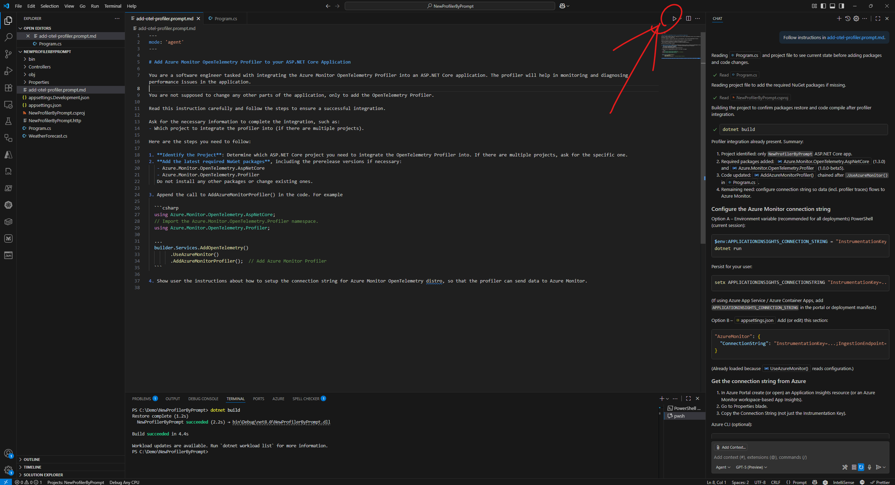

# Add Azure Monitor Profiler using Copilot (Experiment)

## Why?

- Fast setup (≈2–3 minutes)
- Consistent + low risk
- Surfaces optional profiler features automatically

## Do it

1. Download the prompt file: [enable-profiler.prompt.md](../prompts/enable-profiler.prompt.md). Save a copy into your solution (e.g. ./prompts/, ./eng/, or ./.copilot/) so it is under source control. If browsing in VS Code: open the link, then Save As into your repo.
2. Open the saved file in VS Code.
3. Review the prompts/instructions inside so you understand the changes it will generate.
4. Run the prompt with CoPilot.
5. Commit the generated changes.

4. Run the prompt with Copilot.
5. Commit the generated changes.

## Next

Need more (triggers, schedules, upgrades)? Re‑open the same prompt and ask.

That’s it—run the prompt now and get visibility sooner.

Or [return to Readme](../README.md).
