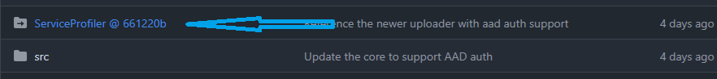

# Developer Enlistment

Because of the special settings of the repo, combing symbolic links and submodules, there are some special sequence needed to get the repository ready for contribution. Here's the guidance.

## Pre-requisition

* PowerShell 7 (if you want to leverage the powershell scripts.)
* Git Credential Manager (to access devdiv repo)

## Enlist

1. Create a folder of your local repository, for example:

    ```shell
    mkdir OTelProfiler
    ```

1. In the folder, clone the `ServiceProfiler` repository first:

    ```shell
    OTelProfiler> git clone https://devdiv.visualstudio.com/DefaultCollection/OnlineServices/_git/ServiceProfiler

    Cloning into 'ServiceProfiler'...
    remote: Azure Repos
    remote: Found 147342 objects to send. (1002 ms)
    Receiving objects:  59% (87870/147342), 315.62 MiB | 41.01 MiB/s
    ```

    Note: the target folder has to be `ServiceProfiler` under your repo root.

1. Check out the target commit for the submodule:

    ```shell
    ServiceProfiler> git checkout Commit#
    ```

    Note: this is a temporary step.

    Find the proper commit to checkout on github:

    

1. Get ready to reestablish the symbolic links in your repo root folder, for example `OTelProfiler`:

    ```shell
    git init
    git config core.symlinks true
    git remote add origin https://github.com/xiaomi7732/Azure.Monitor.OpenTelemetry.Profiler
    git fetch -p --all
    ```

1. Open another command prompt **as administrator**, and go to the repro root and run:

    ```shell
    git checkout main
    exit
    ```

If you got everything correct, now you can run the build script to build the code successfully:

```powershell
.\src\ServiceProfiler.EventPipe.Otel\tools\BuildSolution.ps1 Debug
```
