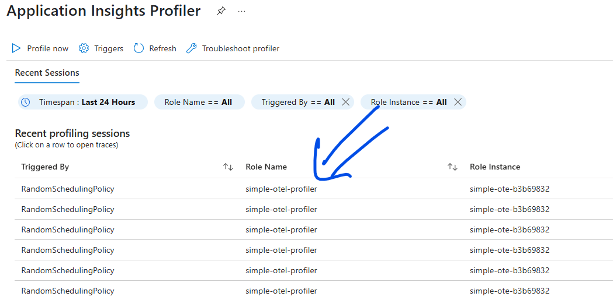

# Setup the Role Name

Setting up a proper role name helps organize profiling sessions effectively. For example:



## How to set it up

1. **Azure App Service**:  
   If you are running on `Azure App Service`, the role name will be set up for you **automatically**. It uses the `WEBSITE_SITE_NAME` environment variable.

1. **Other Platforms**:  
   If you are running the application on other platforms (e.g., a development machine, an on-prem Kubernetes cluster, AKS, etc.), you can set the value using [OpenTelemetry Resource Semantic Conventions](https://opentelemetry.io/docs/specs/semconv/resource/), specifically `service.name`. There are several ways to do this:

    * **Using environment variables**:

      ```plaintext
      # Only need to set one.
      OTEL_RESOURCE_ATTRIBUTES="service.name=simple-otel-profiler,other.settings=othervalue"
      OTEL_SERVICE_NAME="simple-otel-profiler"
      ```

    * **Using code**:  

      ```csharp
      builder.Services.AddOpenTelemetry().UseAzureMonitor();
      builder.Services.ConfigureOpenTelemetryTracerProvider((_, b) => 
          b.ConfigureResource(resourceBuilder => resourceBuilder.AddService("service-name"))  // Set service.name to `service-name`
      );
      ```

    For more details, refer to [Adding Custom Resource](https://learn.microsoft.com/en-us/dotnet/api/overview/azure/Monitor.OpenTelemetry.AspNetCore-readme?view=azure-dotnet#adding-custom-resource).

1. **Feedback**:  
   If you think the value should be automatically populated for the platform the app's running on, please [open an issue](https://github.com/Azure/azuremonitor-opentelemetry-profiler-net/issues).

## Under the hood

1. **Role Name Detectors**:  
   We have built several role name detectors. Each detector attempts to retrieve the role name from a specific source, and they are chained together. For example:

    ```csharp
    // Retrieve value from OpenTelemetry resource semantic conventions (`service.name`).
    services.AddSingleton<IRoleNameDetector, OtelResourceRoleNameDetector>();
    // Retrieve value from the `WEBSITE_SITE_NAME` environment variable.
    services.AddSingleton<IRoleNameDetector, EnvRoleNameDetector>(_ => new EnvRoleNameDetector("WEBSITE_SITE_NAME"));
    // Retrieve value from another environment variable.
    services.AddSingleton<IRoleNameDetector, EnvRoleNameDetector>(_ => new EnvRoleNameDetector("RoleName"));
    // Issue a warning if no value is provided.
    services.AddSingleton<IRoleNameDetector, UnknownRoleNameDetector>(); 

    // Aggregate the detections.
    services.AddSingleton<IRoleNameSource, AggregatedRoleNameSource>(); 
    ```

    See the [source code here](https://github.com/Azure/azuremonitor-opentelemetry-profiler-net/blob/1c98789ec379fd6b89a0296b69aeaa0b3b86e1ac/src/ServiceProfiler.EventPipe.Otel/Azure.Monitor.OpenTelemetry.Profiler.Core/ServiceCollectionExtensions.cs#L44).

## In the future

In the future, OpenTelemetry aims to provide values automatically for various environments, eliminating the need for manual configuration.

For example, in a Kubernetes cluster, the service name can be derived from well-known labels. Refer to the [OpenTelemetry Semantics Non-normative specs](https://opentelemetry.io/docs/specs/semconv/non-normative/k8s-attributes/#how-servicename-should-be-calculated) for more details.
